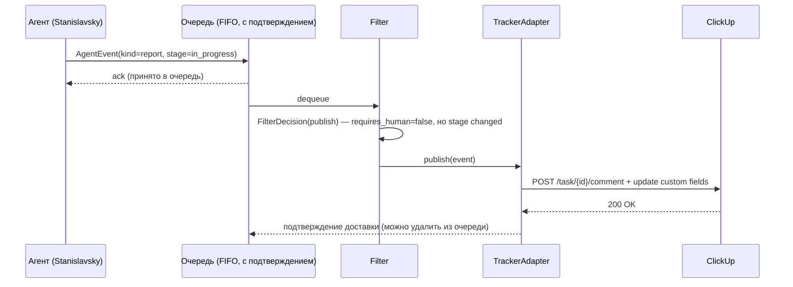
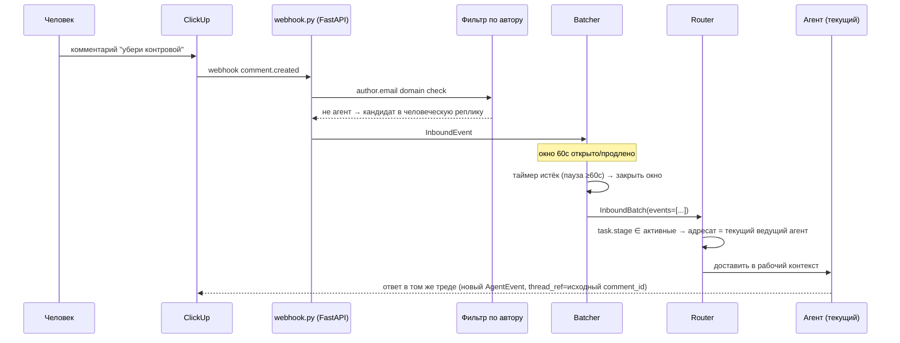
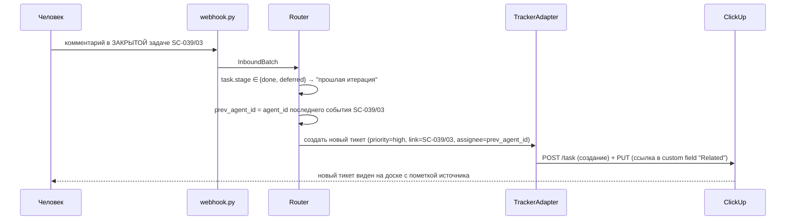
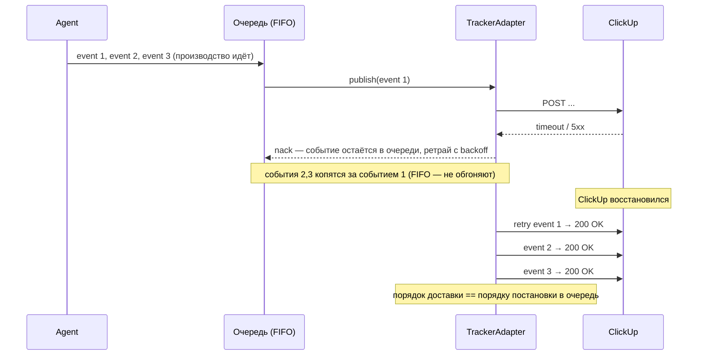
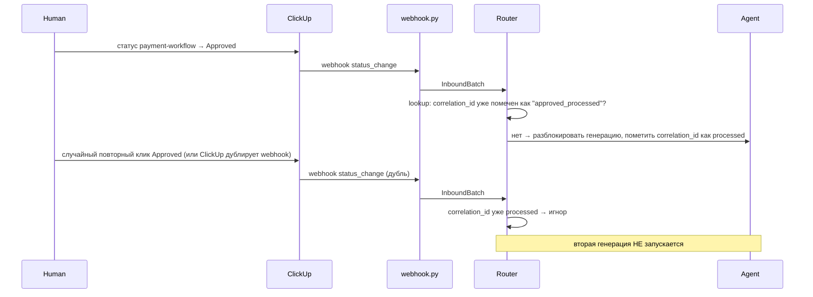

# План архитектуры: Workflow Control Layer

> Дополняет `02_architecture.md` (исходник) конкретикой: точные модели данных, интерфейсы, sequence-диаграммы, дефолтные значения. Где решение уже принято в исходнике — не повторяется, а уточняется до уровня "можно писать код".

## 1. Модули и их интерфейсы (контракты между модулями ядра)

```
prototype/
├── core/
│   ├── events.py           # AgentEvent, TaskState, DeliveryResult, FilterDecision — pydantic-модели
│   ├── state_machine.py    # WorkflowConfig, transitions, rework_branch
│   ├── filter.py           # Filter: FilterContext -> FilterDecision (конфиг-based, безопасный AST-интерпретатор)
│   ├── llm.py               # обёртка над LLM-провайдером (Qwen) — единственное место, где он конструируется
│   ├── outbound_queue.py    # OutboundQueue — глобальный FIFO retry (сценарий 07)
│   ├── clock.py             # Clock protocol (RealClock / FakeClock) — см. §5
│   └── ids.py               # генерация correlation_id / batch_id / event_seq
├── adapters/
│   ├── base.py             # TrackerAdapter(Protocol), реэкспортирует DeliveryResult из core/events.py
│   ├── clickup.py          # реальный API
│   └── memory.py           # in-memory, для sim и тестов
├── inbound/
│   ├── webhook.py          # FastAPI-эндпоинт, приём + верификация подписи
│   ├── batcher.py          # Batcher: sliding window 60с + потолок 300с
│   ├── router.py           # RuleBasedRouter — настоящий детерминированный Router (см. §7)
│   └── comment_router.py    # CommentRouter — LLM-путь живого демо-среза (узкий, 3 демо-агента), Qwen через core/llm.py
├── agents/
│   ├── mock_camera.py
│   ├── mock_actor.py
│   ├── mock_continuity.py
│   ├── mock_cost.py         # нужен для сценария 06, см. 00_overview.md §2
│   ├── _shared.py           # общий build_event(...) для моков
│   └── live_demo_agent.py   # реакция на живой ClickUp-доске (не мок — реальный AgentEvent + Qwen-ответ)
├── sim/
│   ├── system.py             # System/build_system — тестовый харнес (Queue+Filter+Router+Batcher на memory.py)
│   ├── scenarios/            # s01_happy_path.py … s07_clickup_outage.py (префикс "s" — "01_x.py" не импортируется в Python)
│   └── runner.py             # make demo входная точка
└── README.md
```

**Правило зависимостей:** `core/` не импортирует ничего из `adapters/`, `inbound/`, `agents/`. `adapters/` и `inbound/` зависят от `core/`, не друг от друга напрямую (общаются только через очередь/интерфейсы). Это то, что физически гарантирует "новый агент/трекер — без переписывания ядра" (нефункциональное требование ТЗ).

**Обновление (2026-08-13):** реализовано полностью, включая `sim/`-слой, которого не было на момент написания этого документа. `DeliveryResult` переехал из `adapters/base.py` в `core/events.py` (нужен `core/outbound_queue.py`, который не может импортировать из `adapters/`) — `adapters/base.py` реэкспортирует имя, существующие импорты не меняются. `TaskState` (пробел §7, ниже) закрыт — определён в `core/events.py`, собирается вызывающей стороной (`sim/system.py`), не самим Router'ом.

## 2. Модели данных (уточнение `02_architecture.md` §2)

```python
# core/events.py
from datetime import datetime
from typing import Literal, Any
from pydantic import BaseModel

Stage = Literal["backlog", "planned", "in_progress",
                 "ready_for_verification", "verification", "done", "deferred"]

class AgentEvent(BaseModel):
    kind: Literal["report", "decision_request", "flag"]
    agent_id: str
    task_id: str
    stage: Stage
    correlation_id: str          # outbound idempotency key (см. 00_overview.md §5.2)
    event_seq: int                # монотонный номер события в рамках task_id
    payload: dict[str, Any]       # свободная форма — конверт для разнородного аутпута агентов
    cost_usd: float | None = None
    requires_human: bool = False
    deadline: datetime | None = None
    prev_agent_id: str | None = None
    thread_ref: str | None = None  # id родительского комментария ClickUp, если ответ в существующем треде
    version: str | None = None

class InboundEvent(BaseModel):
    """Сырое событие из ClickUp webhook, ДО батчинга и роутинга."""
    source: Literal["clickup"]
    clickup_task_id: str
    author_user_id: str
    author_email: str
    kind: Literal["comment", "status_change", "field_edit", "mention"]
    body: str | None = None
    new_status: str | None = None
    field_name: str | None = None
    field_value: Any = None
    received_at: datetime

class InboundBatch(BaseModel):
    """Единица работы для Router — см. 00_overview.md §5.2 про разведение id."""
    batch_id: str
    clickup_task_id: str
    events: list[InboundEvent]
    window_opened_at: datetime
    window_closed_at: datetime

class FilterDecision(BaseModel):
    action: Literal["publish", "publish_digest_only", "drop"]
    reason: str  # для аудита/дебага — какое правило сработало
```

## 3. Машина состояний — конфигурация per-домен, не единый enum

**Обновлено по факту `docs/08_dataset_analysis.md` (находка №1):** разбор реального демо-датасета костюмного цеха показал, что разные домены (камера/генерация vs костюмы) используют **полностью разные** наборы статусов ClickUp — 7 стадий из `01_tz.md` §3 не универсальны, это конкретика одного домена, не абстрактная модель на все случаи. Значит `Stage` — не фиксированный `Literal`, а `str`, чья легальность и поведение задаются `WorkflowConfig` (одна конфигурация на List/домен):

```python
# core/state_machine.py
class EscalationPolicy(BaseModel):          # политика молчания (P6/R6) — теперь с реальными числами, см. ниже
    timeout_min: int
    action: Literal["pause", "apply_agent_recommendation", "repeat_escalation"]
    escalate_to: list[str] = []
    repeat: bool = False

class StageDefinition(BaseModel):
    id: str
    name: str
    waits_for_human: bool = False
    active_for_routing: bool = True          # docs/07_grilled.md находка №2 (Deferred/Blocked ≠ закрыто)
    rework_branch: Literal["cheap_edit", "needs_regeneration"] | None = None
    escalation: EscalationPolicy | None = None

class WorkflowConfig(BaseModel):
    id: str
    stages: dict[str, StageDefinition]
    transitions: dict[str, list[str]]
    closed_stages: set[str]                  # комментарий сюда → новый тикет, не доработка (P3, ветка 2)
```

Реализованы (`prototype/core/state_machine.py`) **две** конкретные конфигурации — не как гипотеза "теоретически можно", а как рабочее доказательство:

- **`CAMERA_PIPELINE`** — исходная 7-стадийная модель из `01_tz.md`/`02_architecture.md` (Backlog→Planned→In Progress→Ready for Verification→Verification→Done, +Deferred).
- **`COSTUME_PIPELINE`** — из `docs/source/stanislavsky_costume_demo_dataset_v2.json`: `backlog, ready, wardrobe_check, coverage_review, cost_approval, in_generation, qc, regenerate, accepted, blocked`. Переходы выведены из реальных `state_history`/`status_change` событий датасета (см. `docs/08_dataset_analysis.md`).

### Rework-классификация (branch), не денежная формула

**Исправлено грилл-ревью (`07_grilled.md`, находка №4), теперь как метод `WorkflowConfig.classify_branch(stage)`:** роль стадии — не множитель в формуле подсчёта $ (`estimated_rework_cost = cost * multiplier` — ниоткуда не выведенная арифметика, противоречащая демо-трейсу деки), а **селектор ветки**: нужна ли для правки на этой стадии вообще новая генерация.

```
branch = workflow.classify_branch(stage)     # StageDefinition.rework_branch

if branch == "cheap_edit":                     # артефакта ещё нет — правка брифа, не пересоздаёт результат
    → доработка (передать агенту, R3 ветка 1), без обращения к Cost-агенту

elif branch == "needs_regeneration":           # артефакт есть/генерация запущена
    cost_usd = CostAgent.estimate(task, requested_change)   # ВСЕГДА свежая оценка, как в демо-трейсе деки
    if cost_usd <= threshold:  → новая итерация (Regenerate), approve не нужен
    else:                       → эскалация: payment-workflow тикет, approve нужен (сценарий 06)

# стадии с waits_for_human=True (cost_approval, coverage_review, regenerate, blocked, deferred):
# classify_branch не вызывается вообще — сама стадия УЖЕ точка решения человека, не точка выбора ветки.
```

`APPROVAL_THRESHOLD_USD_DEFAULT = 15.0` — фоллбек-дефолт для camera-домена (демо-трейс деки: $18 > $15). **Порог — per-workspace/per-task конфигурация** (custom field `cost_threshold`, `03_clickup_requirements.md` §3), не глобальная константа: costume-датасет использует ₽50 000 для того же поля — другой домен, другая валюта и число, то же самое место в контракте. Это ещё одно независимое подтверждение, что пороги/стадии нельзя зашивать в код одним значением на все случаи.

### Политика молчания — теперь с реальными числами, не только "допущение"

`docs/08_dataset_analysis.md` находка №2: датасет costume-домена даёт готовую таблицу `escalation_policies`, перенесённую в `COSTUME_PIPELINE.stages[*].escalation`:

| Стадия | `timeout_min` | `action` | `escalate_to` | `repeat` |
|---|---|---|---|---|
| `cost_approval` | 30 | `pause` | Тимур | нет |
| `regenerate` | 20 | `apply_agent_recommendation` | Супервайзер | нет |
| `coverage_review` | 30 | `apply_agent_recommendation` | Супервайзер | нет |
| `blocked` | 240 | `repeat_escalation` | Продюсер, Первый ассистент | **да** |

`repeat_escalation` — третий вид действия по дедлайну, не предусмотренный в первой версии этого документа (было только `auto_apply_recommendation | pause_and_requeue`): периодическая нагрузочная эскалация, пока стадия не разблокирована человеком, а не одноразовое действие. Добавлен в `SilenceAction`.

Для camera-домена таких чисел в исходниках нет за пределами одного примера (approve по деньгам) — `CAMERA_PIPELINE.stages["deferred"].escalation` использует `DEFAULT_DECISION_DEADLINE_MINUTES = 30` как единственный подтверждённый фоллбек; остальные camera-стадии не имеют `waits_for_human=True` в текущей 7-стадийной модели вовсе (см. `06_open_questions.md`).

Переходы между стадиями (camera-домен):

```
Backlog → Planned → In Progress → Ready for Verification → Verification → Done
                          ↑                                      │
                          └──────────── Regenerate ──────────────┘
                    (Deferred достижим из любой активной стадии; возврат — в исходную стадию)
```

Переходы costume-домена — см. `prototype/core/state_machine.py::COSTUME_PIPELINE.transitions` (выведены из реальных трейсов датасета, не придуманы).

## 4. Sequence-диаграммы

### 4.1 Outbound happy path (сценарий 01)



### 4.2 Inbound: комментарий текущему агенту (сценарий 02)



### 4.3 Inbound: комментарий агенту прошлой итерации (сценарий 03)



### 4.4 Надёжность: ClickUp недоступен (сценарий 07)



### 4.5 Идемпотентный approve (сценарий 06, повторный клик)



## 5. Clock — абстракция, без которой тесты будут флакать

Батчинг (60с окно) и дедлайны нельзя тестировать реальным `sleep()` — тесты будут медленными и нестабильными. Вводим протокол:

```python
# core/clock.py
class Clock(Protocol):
    def now(self) -> datetime: ...
    def sleep_until(self, dt: datetime) -> None: ...  # no-op / instant для FakeClock

class RealClock: ...   # для prod и demo
class FakeClock:        # для sim/tests — управляемое время
    def advance(self, seconds: float) -> None: ...
```

`Batcher` и dead­line-checker принимают `Clock` через конструктор (dependency injection), не вызывают `datetime.now()`/`time.sleep()` напрямую нигде в `core/`/`inbound/`. Это единственный способ детерминированно тестировать сценарии 04 (батчинг) и 06/07 (дедлайны, недоступность) без реального ожидания — critical для `make demo` укладываться в 10 минут (ТЗ §5).

## 6. TrackerAdapter — интерфейс (реализуется `clickup.py` и `memory.py`)

```python
# adapters/base.py
class TrackerAdapter(Protocol):
    def publish(self, event: AgentEvent) -> DeliveryResult: ...
    def create_linked_task(self, source_task_id: str, priority: str,
                            assignee_agent_id: str | None) -> str: ...
    def post_comment(self, task_id: str, body: str) -> str: ...          # top-level комментарий
    def post_reply(self, parent_comment_id: str, body: str) -> str: ...  # ОТДЕЛЬНЫЙ endpoint у ClickUp,
                                                                          # не параметр post_comment — см. 03_clickup_requirements.md §6.2
    def set_status(self, task_id: str, status: Stage) -> None: ...
    def set_custom_field(self, task_id: str, field: str, value: Any) -> None: ...
    def is_processed(self, correlation_id: str) -> bool: ...   # идемпотентность
    def mark_processed(self, correlation_id: str) -> None: ...
```

`AgentEvent.thread_ref`, если заполнен, определяет вызов `post_reply` вместо `post_comment` — решение принимается в `clickup.py`/`memory.py`, не в `core/` (ядро оперирует только `thread_ref: str | None`, ему всё равно, что за этим стоят два разных HTTP endpoint'а у ClickUp).

`memory.py` реализует то же самое поверх словарей в памяти процесса — используется и в `sim/` (все 7 сценариев валидации), и в юнит-тестах, и в демо без токена (ТЗ §4, критерий сдачи). `clickup.py` — единственное место, которое знает про реальные endpoint'ы ClickUp API (см. `03_clickup_requirements.md`), включая нюанс: обновление custom field — **отдельный HTTP-вызов на каждое поле** (нет batch), это стоит учесть при оценке количества запросов на одно событие (до 6 запросов на насыщенный AgentEvent — см. `03_clickup_requirements.md` §3).

## 7. Router — интерфейс

```python
# inbound/router.py
class RouterAction(BaseModel):
    kind: Literal["deliver_to_agent", "new_ticket", "pipeline_command", "escalate"]
    target_agent_id: str | None
    payload: dict

class Router(Protocol):
    def route(self, batch: InboundBatch, task_state: TaskState | None) -> RouterAction: ...
```

`TaskState` (`core/events.py`, реализовано) — `task_id`, `stage`, `current_agent_id`, `known_agent_ids: frozenset[str]`. Собирается вызывающей стороной (`sim/system.py::System._task_state_for`), не Router'ом — `inbound/router.py` не имеет права обращаться к `adapters/` напрямую, ровно тот же принцип, что `core/` не импортирует `adapters/`.

Roadmap #7 ("классификатор реплик на LLM") — реализован, но не как замена `RuleBasedRouter` за тем же протоколом, а как отдельный узкий класс `inbound/comment_router.py::CommentRouter`, специфичный для живого демо-среза (3 захардкоженных демо-агента, реальный ClickUp). `RuleBasedRouter` (детерминированный, `docs/00_overview.md` §4.3) остаётся основным Router'ом для `sim/`/приёмочных сценариев — переключение между двумя реализациями сейчас происходит по вызывающему коду (`webhook.py` берёт `CommentRouter`, `sim/system.py` — `RuleBasedRouter`), не по общей конфигурации через единый протокол, как здесь изначально предполагалось.

### 7.1 Канал разрешения decision_request — конвенция (найдено при грилл-ревью, находка №5)

Открытый вопрос при грилле: если на одной задаче одновременно висят два независимых `decision_request` (например, Camera ждёт подтверждения варианта покрытия, а Cost — approve бюджета), одно поле статуса ClickUp не может выразить "решены оба/только один" — риск перепутать, какое решение относится к какому запросу. Разбор демо-трейса деки и ТЗ R8 показывает, что паттерн **уже неявно существует**, просто не назван — фиксируем его явно как конвенцию, не дожидаясь дополнительного решения пользователя:

- **decision_request об артефакте самой задачи** (подтвердить вариант покрытия, принять правку) → разрешается сменой **статуса главной задачи** (`Approved`/`Regenerate`, R8) — потому что такое решение и есть следующий шаг жизненного цикла этой же задачи.
- **decision_request о ресурсе, не о содержимом артефакта** (approve бюджета — Cost, в перспективе: approve доступа к дорогой модели и т.п.) → разрешается через **отдельную линкованную сущность** (payment-workflow-тикет), как уже показано в демо-трейсе деки и сценарии 06 ТЗ. У главной задачи в этот момент собственный статус не трогается вообще (она просто "заблокирована", ждёт).

Правило выбора канала — по `AgentEvent.kind == "decision_request"` + агенту-источнику (Cost и в будущем любой "ресурсный" агент → payment-workflow; остальные → статус задачи), не по содержимому `payload`. Это устраняет двусмысленность без введения нового поля в контракт.

## 8. Filter — конфигурация (не хардкод)

**Исправлено грилл-ревью (`07_grilled.md`, находка №1):** `payload.stage_changed` в первой версии этого YAML предполагал, что *агент сам* кладёт флаг "стадия изменилась" в свой нетипизированный `payload` — это прямое нарушение собственного принципа P2 ("агенты имеют разный аутпут", контракт не должен зависеть от того, что именно агент решил положить в payload). "Изменилась ли стадия" — фактически вычислимая величина (сравнение `event.stage` текущего события с последней известной стадией того же `task_id`), и вычислять её должно **ядро** (компонент перед Filter, хранящий "последнюю известную стадию per task_id"), не агент. Filter получает уже обогащённый объект, а не сырой `AgentEvent`:

```python
# core/filter.py
class FilterContext(BaseModel):
    event: AgentEvent
    stage_changed: bool     # вычислено ядром: event.stage != last_known_stage[event.task_id]
```

```yaml
# core/filter_config.yaml (пример)
publish_rules:
  - if: "requires_human == true"
    action: publish
  - if: "kind == 'flag'"
    action: publish
  - if: "kind == 'report' and stage_changed == true"    # поле FilterContext, не payload
    action: publish
  - if: "cost_usd != null and cost_usd > threshold_usd"
    action: publish
default_action: drop   # внутренний обмен агент↔агент, микросостояния — остаются дома
rate_ceiling:
  max_events_per_task_per_minute: 5
  overflow_action: publish_digest_only   # roadmap #3, тот же интерфейс FilterDecision
```

**Ещё один нюанс, всплывший при грилле:** поле `if` выглядит как строка на исполнение (`eval`-подобная). Использовать реальный `eval()` над конфигом — даже доверенным — плохая практика (сложно тестировать, легко сломать опечаткой без явной ошибки). **Решение:** реализовать не через `eval`, а через маленький безопасный интерпретатор сравнений (`simpleeval`-класс библиотек, или ручной парсер 3-4 операций: `==`, `!=`, `>`, `and`) — объём словаря условий здесь маленький и фиксированный, полноценный DSL не нужен, но `eval()` на конфиге — нет.

## 9. Границы прототипа vs то, что реализуется позже

Явно (перекликается с roadmap, но зафиксировано здесь как *архитектурное* решение, не только "план"):

- **В прототипе:** `RuleBasedRouter`, `publish`/`drop` фильтр (без `publish_digest_only` активно используемого — интерфейс есть, политика потолка не включена по умолчанию), один `TrackerAdapter` (ClickUp) + `memory`, глобальный FIFO без партиционирования.
- **Не в прототипе, но не блокируется архитектурой:** LLMRouter, второй адаптер (Linear/Jira), Conductor-дайджест как consumer очереди, реконсиляция по расписанию, приоритетная очередь при лимите API.

Это прямая проверка тезиса roadmap "каждый следующий шаг ложится в готовые точки расширения" — если для очередного пункта roadmap требуется трогать `core/`, значит текущая архитектура спроектирована неверно. Держать в голове как критерий качества на протяжении всей реализации.
